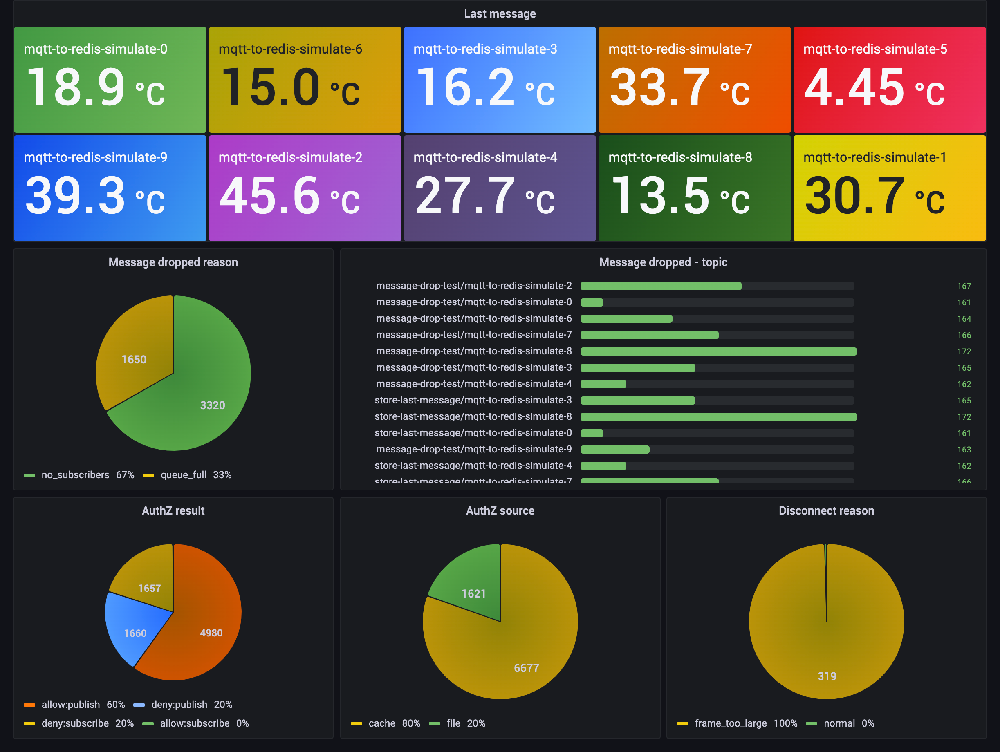

# mqtt-to-redis

Ingesting IoT data into Redis using MQTT and EMQX | MQTT Redis Integration

## Introduction

This tutorial will show you how to use MQTT to ingest IoT data and client events into Redis. We are using the [Redis](https://Redis.com/) to statistics on EMQX client authorization results and reasons for message dropped, and storing messages for specific topics. The data will be visualized in Grafana.



**Why Redis?**

- Redis has high performance, making it an ideal choice for caching IoT messages, enabling quick storage and retrieval of massive data generated by devices and sensors. Its fast read and write capabilities, along with low latency, ensure real-time data processing and responsiveness.

- Redis demonstrates flexibility through its rich set of commands and data structures, allowing for diverse data processing in IoT scenarios. By utilizing Redis counters and related commands, easy event counting and data aggregation become possible. For instance, one can calculate device activity or average sensor data, providing robust support for real-time data analysis and monitoring.

- Redis's powerful support for geospatial data plays a crucial role in IoT applications. With Redis's geospatial data type and relevant commands, storing and querying device or user location information becomes convenient. This proves useful in applications like location services, logistics tracking, and nearby device searching. Additionally, combining geospatial information with other data allows for more complex geospatial analysis and visualization.

Overall, Redis's widespread usage in IoT is attributed to its high performance, flexibility, and feature-rich capabilities. It serves as a reliable data storage and processing solution, providing efficient, real-time, and scalable data management for IoT applications while supporting complex data operations to meet diverse IoT use case requirements.

## Architecture

| Name      | Version | Description                                                                      |
| --------- | ------- | -------------------------------------------------------------------------------- |
| [EMQX Enterprise](https://www.emqx.com/en/products/emqx)      | 5.0.3+  | MQTT broker used for message exchange between MQTT clients and the Redis. |
| [Node.js](https://nodejs.org) | 18.17 | Simulating message publish, authorization, message dropped events for MQTT clients. |
| [Redis](https://redis.io/)     | 7.0.12  |  Statistics on client authorization results and reasons for message dropped, storing messages for specific topics.     |
| [Grafana](https://grafana.com/)   | 9.5.1+  | Visualization platform utilized to display and analyze the collected data.       |

## How to use

1. Please make sure you have installed the [docker](https://www.docker.com/), and then running the following commands to start the demo:

  ```bash
  docker-compose up -d
  ```

2. Running the following commands to view data in Redis:

  ```bash
  docker exec -it redis bash

  redis-cli

  keys *
  1) "emqx_message_dropped_count"
  2) "emqx_messages"
  3) "disconnected_reason"
  4) "authz_result"
  5) "message_dropped_reason"
  6) "authz_source"
  ```

3. If you want to view the client event analysis result and stored message in Grafana dashboard, you can open <http://localhost:3000> in your browser, and login with `admin:public`.
   > When you first start up, you will need to wait 2-3 minutes for the page to be available due to the need to install the Redis datasource.

## License

[Apache License 2.0](./LICENSE)
